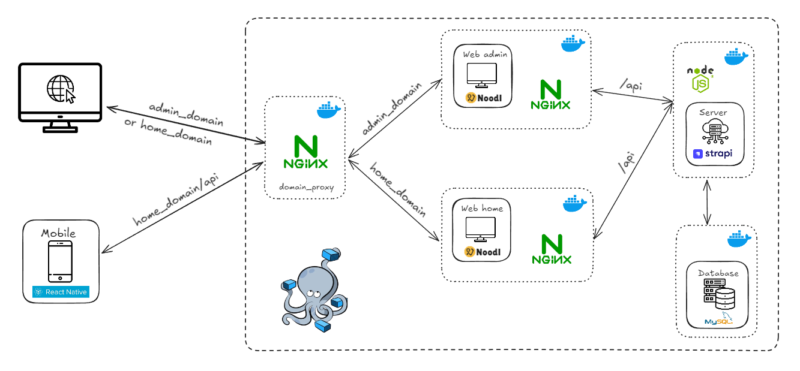

# 

**UniHand** là ứng dụng hoạt động trên đang nền tảng sử dụng nền tảng **Low-Code**, được phát triển trong khuôn khổ cuộc thi [Phần Mềm Nguồn Mở - Olympic Tin học Sinh viên Việt Nam 2024](https://www.olp.vn/procon-pmmn/ph%E1%BA%A7n-m%E1%BB%81m-ngu%E1%BB%93n-m%E1%BB%9F).  
Ứng dụng nhằm mục tiêu **kết nối cộng đồng**, cung cấp **thông tin nhanh chóng**, và quản lý **hỗ trợ nhân đạo** trong các tình huống khẩn cấp hoặc sau đại dịch, thiên tai.

[](https://github.com/TVU-OPS/UniHand/stargazers) [](https://github.com/TVU-OPS/UniHand/network/members) [](https://github.com/TVU-OPS/UniHand/blob/main/LICENSE)
[](https://github.com/TVU-OPS/UniHand/issues) [](https://github.com/TVU-OPS/UniHand/commits/main) [](https://github.com/TVU-OPS/UniHand/graphs/contributors)

---

# 

[](https://docs.unihand.site/)

## **Mục lục**

1. [Giới thiệu](#giới-thiệu)
2. [Chức năng](#chức-năng)
3. [🔎 Về hệ thống](#-về-hệ-thống)
   - [Môi trường, Công nghệ và Công cụ](#môi-trường-công-nghệ-và-công-cụ-dùng-để-phát-triển)
   - [Sơ đồ hoạt động](#sơ-đồ-hoạt-động)
4. [🔧 Cách cài đặt](#-cách-cài-đặt)
   - [Yêu cầu hệ thống](#yêu-cầu-hệ-thống)
   - [Cài Đặt](#cài-đặt)
5. [🎁 Đóng góp](#-đóng-góp)
6. [Tài Liệu Hỗ Trợ](#tài-liệu-hỗ-trợ)
7. [📃 License](#-license)
8. [Cộng đồng và đóng góp](#cộng-đồng-và-đóng-góp)
9. [Liên hệ](#liên-hệ)

## Giới Thiệu

- Dự án này được phát triển nhằm đáp ứng nhu cầu ứng dụng công nghệ thông tin trong các tình huống khẩn cấp, như thiên tai, đại dịch, hoặc các sự kiện thảm họa khác. Mục tiêu của dự án là xây dựng một hệ thống hỗ trợ cộng đồng trong các hoạt động ứng phó khẩn cấp, cung cấp thông tin nhanh chóng và hỗ trợ nhân đạo sau thảm họa.
- Ứng dụng này sử dụng nền tảng **Low-Code Development Platform (LCDP)** mã nguồn mở, cho phép phát triển nhanh chóng và triển khai ứng dụng trong thời gian ngắn, đặc biệt quan trọng trong các tình huống khẩn cấp khi thời gian là yếu tố quan trọng.

## Chức Năng

- **🌐 Kết nối cộng đồng**: Giúp kết nối các cá nhân và tổ chức trong các hoạt động ứng phó và hỗ trợ khẩn cấp.
- **⚡ Cung cấp thông tin nhanh chóng**: Cập nhật thông tin kịp thời về tình hình thiên tai, đại dịch và các hoạt động khắc phục hậu quả.
- **🤝 Hỗ trợ nhân đạo**: Cung cấp các kênh giúp đỡ người dân bị ảnh hưởng sau thảm họa, tình nguyện viên, v.v.
- **⚙️ Đảm bảo sự linh hoạt và tốc độ phát triển**: Với LCDP, ứng dụng có thể được phát triển nhanh chóng và dễ dàng tùy chỉnh theo yêu cầu cụ thể.

## 🔎 Về hệ thống

### Môi trường Công nghệ và Công cụ dùng để phát triển

- [Git](https://git-scm.com): Theo dõi và quản lý các thay đổi trong mã nguồn hiệu quả.
- [NodeJS](https://nodejs.org): Môi trường chạy JavaScript phía máy chủ.
- [Noodl Editor](https://www.noodl.net): Xây dựng ứng dụng full-stack thông qua giao diện các khối kéo thả **(Low-Code)**.
- [Strapi](https://strapi.io): Xây dựng API nhanh gắp nhiều lần thông qua giao diện **(Low-Code)**.
- [MySQL](https://www.mysql.com) Hệ quản trị cơ sở dữ liệu quan hệ.
- [Docker](https://www.docker.com) Tạo, triển khai và chạy các ứng dụng trong container.
- [Docker Compose](https://docs.docker.com/compose) Định nghĩa và quản lý nhiều container trong một ứng dụng.
- [React Native:](https://reactnative.dev) Cho phép xây dựng ứng dụng di động đa nền tảng (Android và iOS).

- Xem thêm chi tiết tại [UniHand Documentation](https://docs.unihand.site/getting-started/environment-software).

### Sơ đồ hoạt động

# 

## Cấu trúc thư mục

- [Backend](https://github.com/TVU-OPS/UniHand/tree/main/backend): Mã nguồn backend, bao gồm cấu hình hệ thống, cơ sở dữ liệu, mã nguồn chính và các tệp cấu hình.
- [Web admin](https://github.com/TVU-OPS/UniHand/tree/main/web-admin): Mã nguồn trang quản trị.
- [Web home](https://github.com/TVU-OPS/UniHand/tree/main/web-home): Mã nguồn trang chủ.
- [App Mobile](https://github.com/TVU-OPS/UniHand/tree/main/app-mobile): Mã nguồn ứng dụng di động.

## 🔧 Cách Cài Đặt

### Yêu cầu hệ thống

- **Git:** phiên bản mới nhất, chi tiết và cài đặt trên trang chủ [Git](https://git-scm.com).
- **NodeJS:** phiên bản 20 trở lên, chi tiết và cài đặt trên [NodeJS Download Package Manager](https://nodejs.org/en/download/package-manager).
- **Docker và Docker Compose:** chi tiết và cài đặt trên trang chủ [Docker](https://www.docker.com).
- Xem thêm các công cụ khác nếu bạn muốn tham gia phát triển dự án tại [UniHand Documentation](https://docs.unihand.site/getting-started/environment-software)

### Cài Đặt

1. Clone dự án

```bash
git clone https://github.com/TVU-OPS/UniHand.git
```

2. Di chuyển vào thư mục dự án

```bash
cd UniHand
```

3. Khởi tạo các biến môi trường cần thiết

```bash
npm run genv
```

- Sau khi khởi tạo xong, bạn có thể truy cập tệp tin .env hệ thống vừa tạo để sửa biến môi trường cho phù hợp.
- Hoặc hệ thống sẽ lấy giá trị mặc định và vẫn hoạt động bình thường.

4. Build và chạy dự án.

```bash
docker compose up -d
```

Mặc định hệ thống sẽ chạy trên:

- Trang chủ: [http://localhost](http://localhost).
- Trang quản trị: [http://admin.localhost](http://admin.localhost).
- Nếu trên môi trường server, bạn có thể thay đổi tên miền localhost thành IP hoặc tên miền của bạn trong tệp tin **.env** hệ thống vừa tạo ở **bước 3** tương ứng với hai biến môi trường **HOME_DOMAIN** và **ADMIN_DOMAIN**.

#### Các Port hệ thống sử dụng sau khi đã chạy thành công

<table>
  <thead>
    <tr>
      <th>Container</th>
      <th>Port</th>
      <th>Mô tả</th>
    </tr>
  </thead>
  <tbody>
    <tr>
      <td>mysql-server</td>
      <td>3306:3306</td>
      <td>Server hệ quản trị cơ sở dữ liệu MySQL</td>
    </tr>
    <tr>
      <td>server-strapi</td>
      <td>1337:1337</td>
      <td>Server API, sử dụng <span style="font-weight: bold">Strapi</span></td>
    </tr>
    <tr>
      <td>web-home</td>
      <td>82:80</td>
      <td>Trang chủ, sử dụng <span style="font-weight: bold">Noodl</span></td>
    </tr>
    <tr>
      <td>web-admin</td>
      <td>81:80</td>
      <td>Trang quản trị, sử dụng <span style="font-weight: bold">Noodl</span></td>
    </tr>
    <tr>
      <td>domain</td>
      <td>80:80</td>
      <td>Proxy domain đến Trang chủ và Trang quản trị, sử dụng <span style="font-weight: bold">Nginx</span></td>
    </tr>
  </tbody>
</table>

## 🎁 Đóng góp

##### Chúng tôi hoan nghênh mọi đóng góp!

- [⛔ Báo Cáo Lỗi](https://github.com/TVU-OPS/UniHand/issues/new?template=bug_report.md&title=[Bug])
- [🆕 Yêu Cầu Tính Năng](https://github.com/TVU-OPS/UniHand/issues/new?template=feature_request.md&title=[Feature+Request])

##### Tài Liệu Hỗ Trợ

- [Hướng Dẫn Đóng Góp](.github/CONTRIBUTING.md)
- [CODE_OF_CONDUCT.md](.github/CODE_OF_CONDUCT.md)

## 📃 License

Được phân phối theo Giấy phép AGPLv3. Xem [`LICENSE.md`](https://github.com/TVU-OPS/UniHand/blob/main/LICENSE) để biết thêm thông tin.

## Cộng đồng và đóng góp

<a href="https://github.com/TVU-OPS/UniHand/graphs/contributors">
  
</a>

## Liên hệ

- UniHand: unihand.ops@gmail.com
- Đinh Tấn Mãi: dinhtanmaivn@gmail.com
- Nguyễn Đình Trí: tringuyen.21092003@gmail.com
- Phạm Hữu Lộc: phamhuulocforwork@gmail.com
