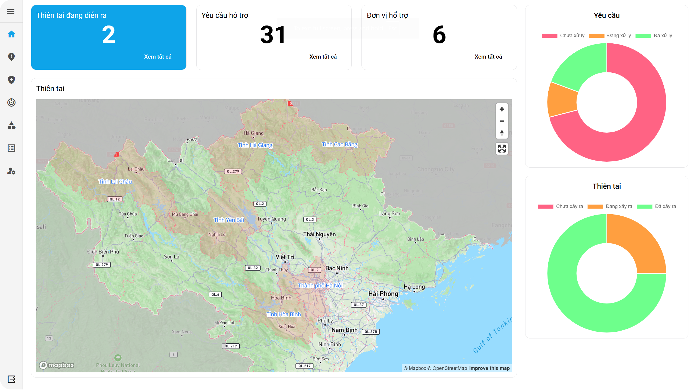

# **Hướng dẫn cài đặt và chạy web-admin**

## **Giới thiệu**
Thư mục `web-admin` chứa mã nguồn của trang quản trị được xây dựng bằng **Noodl**. Dưới đây là hướng dẫn từng bước để cài đặt **Noodl**, thiết lập môi trường và chạy dự án.
# 

---

## **Yêu cầu hệ thống**
Trước khi bắt đầu, hãy đảm bảo hệ thống của bạn đáp ứng các yêu cầu sau:
- **Node.js**: Phiên bản >= 16.x.
- **npm**: Phiên bản >= 8.x.
- **Docker** (nếu cần chạy qua container, không bắt buộc).
- **Git**: Để sao chép dự án từ GitHub.

---

## **Hướng dẫn cài đặt**


## **Bước 1: Tải Noodl**
1. Truy cập trang phát hành chính thức của Noodl:  
   👉 [https://github.com/noodlapp/noodl/releases](https://github.com/noodlapp/noodl/releases)

2. Tìm phiên bản mới nhất trong danh sách các bản phát hành.

3. Tải tệp tin phù hợp với hệ điều hành của bạn:
   - **Windows**: Tải tệp `.exe`.
   - **macOS**: Tải tệp `.dmg`.

4. Sau khi tải về, cài đặt Noodl như một ứng dụng thông thường:
   - **Windows**: Nhấn đúp vào tệp `.exe` và làm theo hướng dẫn.
   - **macOS**: Làm theo các bước cài đặt mặc định của hệ điều hành.

---

## **Bước 2: Clone dự án `UniHand`**
1. Mở **Terminal**

2. Sao chép mã nguồn từ GitHub:
   ```bash
   git clone https://github.com/TVU-OPS/UniHand.git

3. Chuyển vào thư mục **web-admin**
    ```base
    cd UniHand/web-admin

## **Bước 3: Mở dự án bằng Noodl**
1. Khởi chạy Noodl:
- Mở ứng dụng Noodl đã cài đặt từ Bước 1.
2. Mở thư mục dự án trong Noodl:
- Trong giao diện Noodl, chọn Open Project.
- Duyệt đến thư mục **UniHand/web-admin** và mở file cấu hình project.json.
## **Bước 4: Chạy dự án**
Dự án sẽ chạy trên máy cục bộ tại:
 - URL mặc định: http://localhost:8574